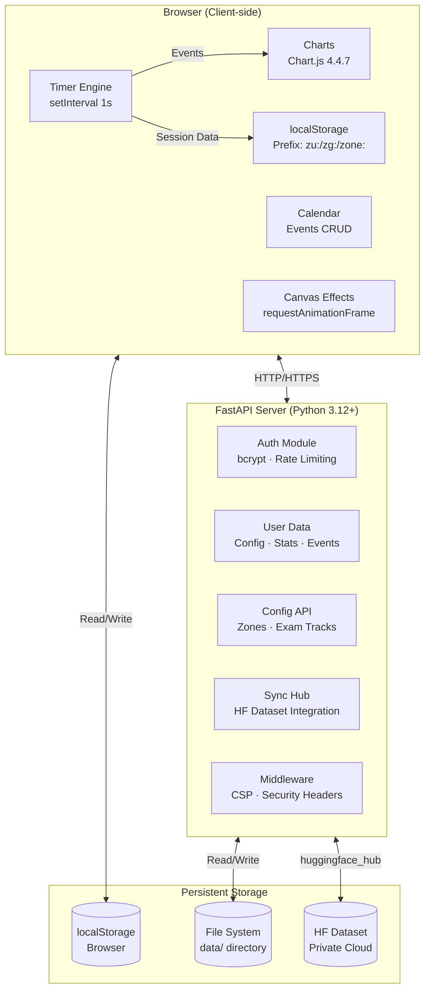
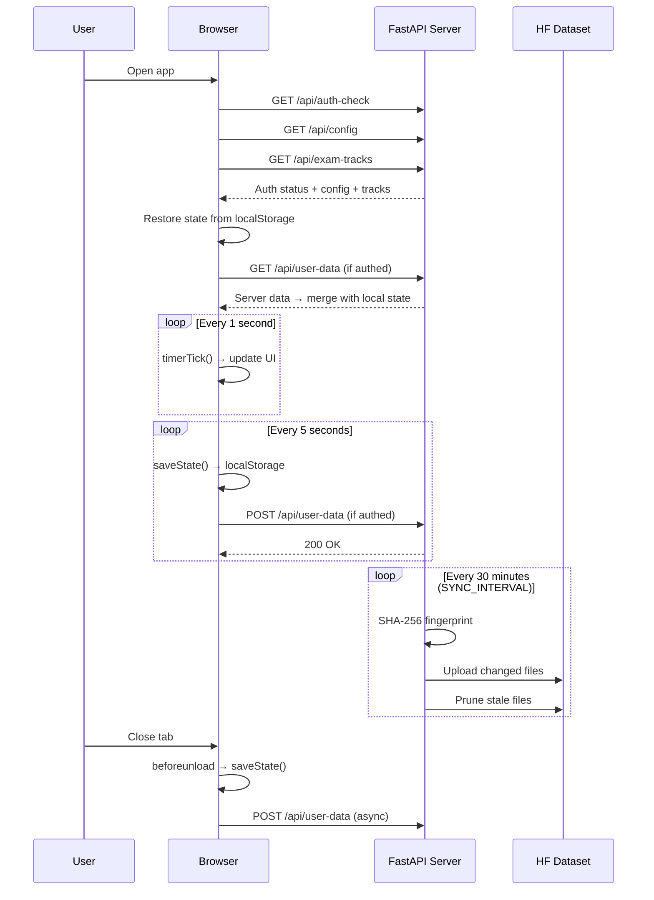

<div align="center">
  <br>

  ```text
███████  ███████  ██   ██  ███████
   ██    ██   ██  ███  ██  ██     
  ██     ██   ██  ██ █ ██  █████  
 ██      ██   ██  ██  ███  ██     
███████  ███████  ██   ██  ███████
  ```

  <h1>Zone — Study Execution System</h1>
  <p align="center">
    <strong>A production-grade Pomodoro study platform</strong><br>
    <em>Multi-zone scheduling · Real-time analytics · Exam countdowns · 6 themes · Cross-device sync · Cloud backup</em>
  </p>

  <br>

  <p align="center">
    <a href="#-features">Features</a> •
    <a href="#-quick-start">Quick Start</a> •
    <a href="#-usage">Usage</a> •
    <a href="#-architecture">Architecture</a> •
    <a href="#%EF%B8%8F-timer-system">Timer</a> •
    <a href="#-analytics--charts">Analytics</a> •
    <a href="#-calendar--events">Calendar</a> •
    <a href="#-exam-tracking">Exams</a> •
    <a href="#%EF%B8%8F-settings">Settings</a> •
    <a href="#%EF%B8%8F-themes--effects">Themes</a> •
    <a href="#-api-reference">API</a> •
    <a href="#-faq">FAQ</a>
  </p>

  <br>

  <p align="center">
    
    
    
    
    
    
  </p>
</div>

---

## 📋 Table of Contents

- [✨ Features](#-features)
- [🚀 Quick Start](#-quick-start)
- [📖 Usage](#-usage)
- [🏗 Architecture](#-architecture)
- [⏱️ Timer System](#%EF%B8%8F-timer-system)
- [📊 Analytics & Charts](#-analytics--charts)
- [📅 Calendar & Events](#-calendar--events)
- [🎯 Exam Tracking](#-exam-tracking)
- [🖼 Wallpaper Studio](#-wallpaper-studio)
- [🎨 Themes & Effects](#-themes--effects)
- [⚙️ Settings](#%EF%B8%8F-settings)
- [⌨️ Keyboard Shortcuts](#%EF%B8%8F-keyboard-shortcuts)
- [📐 Zone Editor](#-zone-editor)
- [💾 Data Management & Sync](#-data-management--sync)
- [👤 Guest vs Authenticated](#-guest-vs-authenticated)
- [🛡 Security](#-security)
- [🔗 API Reference](#-api-reference)
- [🔧 Environment Variables](#-environment-variables)
- [📦 Tech Stack](#-tech-stack)
- [📁 Project Structure](#-project-structure)
- [❓ FAQ](#-faq)
- [🤝 Contributing](CONTRIBUTING.md)
- [📄 License](LICENSE)

---

## ✨ Features

### ⏱️ Timer Engine

| Feature | Description |
|:---|---|
| **Multi-type zones** | Focus, Break, and Buffer zone types, each with independent configuration |
| **Customizable durations** | Per-zone focus duration (5–120 min), break duration (1–30 min), long break duration (1–60 min) |
| **Cycle system** | Each zone has configurable cycles (1–20) with named cycles and visual progress indicators |
| **Long breaks** | Configurable frequency — every N cycles, user-defined duration |
| **Time limits** | Per-zone hard caps (15–300 min, buffer zones capped at 90 min) |
| **Overtime tracking** | When a block completes without taking a break, the timer keeps counting upward in overtime mode — tracked as a distinct event type |
| **Timer presets** | Choose from Pomodoro 25/5, Power 50/10, Deep 90/20, or fully custom |
| **Auto-start breaks** | Optional setting — break begins automatically when a focus block completes |
| **Flow mode** | Optional setting — automatically progresses through all cycles without requiring manual intervention |
| **Manual DONE** | Mark a zone complete without using the timer |
| **Skip block** | Skip the current focus or break block mid-session |
| **Day completion system** | All zones must be completed for the day to count as done — shows a "Mission Complete" overlay with session metrics and confetti |
| **Continue day** | After completing all zones, add an extra unscheduled zone |
| **Continue skipped zone** | Re-open a previously completed or skipped zone for redo |
| **Block timeline** | Horizontal clickable bar showing all cycles — jump to any cycle instantly |
| **Cycle dots** | Visual progress indicators in the zone panel header |
| **Fullscreen mode** | Press `F` to hide all chrome and show only the timer with enlarged controls |
| **Analog ring display** | SVG circular progress ring with 60 tick marks and 5-minute interval markers |
| **Digital countdown** | `MM:SS` display centered in the ring |
| **Overtime display** | Shows `+MM:SS` with an OVERTIME badge when past the limit |
| **Running glow** | Pulsing glow animation on the ring when the timer is active |
| **Block type badge** | "FOCUS" or "BREAK" indicator in the panel header |

### 🔔 Sound System

| Feature | Description |
|:---|---|
| **4 sound packs** | Default (standard chimes), Soft (gentle tones), Digital (electronic beeps), Nature (silent — no sounds) |
| **Transition chime** | Played when a timer block starts or transitions |
| **Break start chime** | Played when a break period begins |
| **Completion chime** | Played when a focus block is completed |
| **Tick sound** | Played once per minute during the last 5 minutes of a focus block |
| **Quiet mode** | Suppresses non-critical notification sounds |
| **Browser notifications** | Native desktop notifications via the Web Notification API for focus complete, break over, zone complete, and day complete events |

### 📊 Analytics Dashboard

| Feature | Description |
|:---|---|
| **Summary stat cards** | Today's sessions, manual completions, focus minutes, skips, all-time total sessions, total focus hours, average session duration, completion rate percentage, and current streak |
| **14-day focus trend chart** | Line chart with smooth tension and area fill showing daily focus minutes over the last 14 days |
| **Zone distribution doughnut** | Session count per zone displayed as a doughnut chart |
| **Completion vs skips doughnut** | Today's completed blocks versus skipped blocks shown as a doughnut chart |
| **Weekly heatmap** | 7-column grid with color intensity levels (low, medium, high, peak) based on daily focus minutes |
| **Daily progress table** | Month-grouped rows showing a horizontal focus bar (capped at 200 min), timer-completed session count, manual completion count (highlighted in blue), skip count (warns in orange if > 2), completion rate percentage, and per-zone color dot indicators |
| **Live activity log** | Real-time scrolling feed of today's events with color-coded icons, local timestamps, and zone references |
| **Zone breakdown panel** | Per-zone statistics including total sessions, total minutes, skip count, and share percentage — click any zone row to navigate directly to it |
| **Day report modal** | Click any date in the daily table to open a detailed modal showing total focus minutes, timer session count, manual completions, skips, completion rate, a zone completion grid with color indicators, and a full event timeline |
| **Streak tracking** | Automatically counts consecutive days where total focus minutes ≥ 30 — resets to zero if a day falls below the threshold |

### 📅 Calendar & Events

| Feature | Description |
|:---|---|
| **Monthly grid view** | Traditional Sun–Sat 7-column layout with day numbers |
| **Event count badges** | Each day cell shows the number of events (capped at "9+") |
| **Event type dots** | Up to 3 colored dot indicators per day cell |
| **Today highlight** | Current day rendered with a gradient blue/purple background |
| **Month navigation** | Previous/next arrow buttons plus a "Today" jump button |
| **8 event types** | Lecture, Test, Coaching, Break, Meal, Personal, Travel, Meeting — each with a distinct auto-assigned color |
| **Full CRUD** | Add, edit, and delete events via modal forms with title, date, start/end time, type selector, and notes fields |
| **Day detail modal** | Click any day cell to open a modal listing all events for that date with quick-add, quick-edit, and quick-delete actions |
| **Indian holidays** | 30+ pre-loaded events including national holidays (Republic Day, Independence Day, Gandhi Jayanti), major festivals (Diwali — 5 days, Holi, Dussehra, Eid ul-Fitr, Eid ul-Adha, Makar Sankranti, Maha Shivaratri, Ugadi, Baisakhi, Rath Yatra, Janmashtami, Ganesh Chaturthi, Mahalaya, Guru Nanak Jayanti, Christmas), and observances (Valentine's Day, Women's Day, Ambedkar Jayanti, Labour Day, Easter, Mother's Day, Father's Day, Yoga Day, Teachers' Day, Halloween, Children's Day, Good Friday, Pohela Boishakh, New Year's Eve) |
| **Holiday toggle** | Show or hide default events via the `showDefaultEvents` setting |
| **Event export** | Download all user-created events as a JSON file |
| **Event import** | Upload a JSON events file — merges with existing events, handling duplicate IDs |

### 🎯 Exam Tracking

| Feature | Description |
|:---|---|
| **7 built-in exam track presets** | JEE Main & Advanced, NEET UG, UPSC Civil Services, GATE, CA Foundation/Inter/Final, Board Exams, and Custom |
| **Auto-configured zones** | Selecting a track automatically configures your daily zone schedule with preset zone names, durations, and order |
| **Per-exam countdown cards** | Each exam displays its own card with a live-ticking countdown |
| **SVG ring countdown** | Circular progress ring showing Days : Hours : Mins : Secs — updates every second with no full re-render |
| **Year progress ring** | Separate circular ring showing the percentage of the year elapsed |
| **Inline date editing** | Click to open a modal for adjusting each exam's target date |
| **Expired state** | When an exam date is reached, displays "Exam Date Reached" with a green highlight |
| **Goal name & tagline** | Auto-generated per track (e.g., "JEE Advanced 2026 — Consistency over intensity") |

**Built-in Exam Track Zone Configurations:**

| Track | Zones |
|:---|---|
| **JEE Main & Advanced** | Morning Core (Physics & Chemistry), Math Practice, Revision, Mock Test, Recovery Buffer |
| **NEET UG** | Biology Core, Chemistry, Physics, Practice Test, Recovery Buffer |
| **UPSC Civil Services** | Current Affairs, Optional Subject, GS Paper, Answer Writing, Recovery Buffer |
| **GATE** | Core Subjects, Aptitude, Previous Year Papers, Mock Test, Recovery Buffer |
| **CA Foundation/Inter/Final** | Accounts, Law, Taxation, Practice, Recovery Buffer |
| **Board Exams** | Subject 1, Subject 2, Subject 3, Revision, Recovery Buffer |
| **Custom Track** | Zone 1 through Zone 5 (user-defined) |

### 🖼 Wallpaper Studio

| Feature | Description |
|:---|---|
| **10 visual style presets** | Mission Control (professional, dark green), Motivational Hustle (motivational, dark warm), Minimal Editorial (professional, light beige), Neon Cyberpunk (edgy, dark purple), Retro Terminal (edgy, black/green monochrome), Nature Calm (calm, earth tones), Cosmic Space (calm, deep navy), Journal Notebook (calm, warm paper), Athletic Bold (motivational, dark red), Corporate Dashboard (professional, dark blue) |
| **Mobile layout** | 300 × 650 pixel portrait orientation |
| **Desktop layout** | 480 × 270 pixel landscape orientation |
| **Zone cards** | Each zone rendered as a card showing zone number, type badge, title, time range, and focus duration |
| **Live preview** | Left panel shows the poster rendering in real time as you switch styles |
| **High-resolution download** | Exports as PNG via html2canvas at 3.6× (mobile) or 4× (desktop) resolution |

### 🎨 Theme Engine

| Theme | Vibe | Accent Colors | Particle Effect | CSS Animations |
|:---|---|---|---|---|
| **Hacker** | Matrix green terminal | `#34D399` · `#38BDF8` | ☔ Matrix rain — katakana and ASCII characters falling in columns | Scanline overlay, glowing text pulse |
| **Cyberpunk** | Neon purple/cyan | `#A78BFA` · `#22D3EE` | 🧬 Glowing particle network with connecting lines | Grid overlay, glitch artifact, flicker effects |
| **Midnight** | Glassmorphism deep blue | `#60A5FA` · `#818CF8` | ⭐ Twinkling starfield with varying brightness and soft halos | Aurora borealis animation, floating glass orbs |
| **Amber** | Warm amber glow | `#FBBF24` · `#FB923C` | 🔥 Ember/ash particles rising from the bottom with glow gradients | Warm ambient pulse |
| **Corporate** | Clean professional blue | `#58A6FF` · `#1F6FEB` | None (CSS-only) | Data count-up animation, inset underline tabs |
| **Platinum** | Premium gold/silver | `#D4AF37` · `#E8E8EE` | None (CSS-only) | Shimmer sweep across panels, gradient text |

Themes are implemented via CSS custom properties on `[data-theme="…"]` selectors — every visual attribute (colors, radii, shadows, typography, panel styles, button styles) is themeable. Ambient particle effects render on a dedicated fixed canvas layer with `requestAnimationFrame` — zero layout impact and `pointer-events: none`.

### 🔐 Security & Data Protection

| Feature | Description |
|:---|---|
| **bcrypt password hashing** | All passwords hashed with bcrypt salt — automatic migration from legacy hash formats |
| **httpOnly session cookies** | Cookies are httpOnly, SameSite=Lax, and Secure (in non-local environments) |
| **30-day session expiry** | Tokens expire after 30 days; stale tokens cleaned on each server load |
| **Content Security Policy** | Restricted sources for scripts, styles, fonts, and images — prevents XSS |
| **Security headers** | `X-Content-Type-Options: nosniff`, `X-Frame-Options: DENY`, `X-XSS-Protection`, `Referrer-Policy: strict-origin-when-cross-origin` |
| **Rate limiting** | 10 authentication attempts per 60 seconds per IP address |
| **Per-user data isolation** | Each user's data stored in a separate directory on disk: `data/users/{username}/` |
| **Guest isolation** | Guest users store all data in browser localStorage — zero data is sent to the server |
| **Admin protection** | Cannot delete or rename the admin account; admin-only API endpoints are gated server-side |

### ☁️ Sync & Backup

| Feature | Description |
|:---|---|
| **Server persistence** | All user data (stats, tracking, events, settings, session, exam data, onboarding status) saved to the server via HTTP POST every 5 seconds |
| **Cross-device sync** | Every page load fetches the latest server data and merges it with local state — the server is the authoritative source |
| **HF Spaces cloud backup** | Automatic backup to a private Hugging Face dataset — SHA-256 fingerprinting detects changes before uploading |
| **Configurable sync interval** | Default 30 minutes, adjustable via the `SYNC_INTERVAL` environment variable |
| **Auto-restore on fresh start** | If no local data exists on container start, automatically restores from the HF dataset |
| **Final sync on shutdown** | Uploads any pending changes when the application shuts down |
| **Remote file pruning** | Automatically deletes stale files from the remote dataset in batched operations |
| **Manual export/import** | Download full user data as JSON or upload a backup file to restore |

---

## 🚀 Quick Start

### Local Development

```bash
# Clone the repository
git clone https://github.com/your-username/zone-study-os.git
cd zone-study-os

# Install Python dependencies
pip install -r requirements.txt

# Set the admin password (required)
export ZONE_PASSWORD=your_secure_password

# Start the development server with hot-reload
python -m uvicorn app.main:app --host 0.0.0.0 --port 7860 --reload
```

Open **[http://localhost:7860](http://localhost:7860)** in your browser. You can sign up for a new account or log in with the default admin credentials (username: `admin`, password: `your_secure_password`).

### Using the Helper Script

```bash
chmod +x start.sh
./start.sh
```

The script will prompt for any required environment variables and start the server.

### Docker Deployment

```bash
# Build the Docker image
docker build -t zone-study-os .

# Run the container
docker run -d \
  -p 7860:7860 \
  -e ZONE_PASSWORD=your_secure_password \
  -v zone-data:/app/data \
  zone-study-os
```

### Docker Compose

```yaml
version: '3.8'
services:
  zone:
    build: .
    ports:
      - "7860:7860"
    environment:
      - ZONE_PASSWORD=your_secure_password
    volumes:
      - zone-data:/app/data
volumes:
  zone-data:
```

### Hugging Face Spaces Deployment

1. **Fork** this repository on GitHub
2. Go to **[Hugging Face Spaces](https://huggingface.co/spaces)** → Click **Create new Space**
3. Select the **Docker** SDK and connect your GitHub repository
4. Navigate to **Settings → Repository Secrets** and add:
   - `ZONE_PASSWORD` — your admin password (required)
5. The Space will build and deploy automatically
6. To prevent spin-down, optionally configure [cron-job.org](https://cron-job.org) keepalive by adding `CRONJOB_API_KEY` and `CRON_TOKEN` to your Space secrets

---

## 📖 Usage

### First Run (Onboarding)

When you open the application for the first time, you are guided through the onboarding flow:

1. **Select an exam track** — Choose from 7 presets (JEE, NEET, UPSC, GATE, CA, BOARDS, CUSTOM) or click "Skip — use default zones" at the bottom
2. **Set your target year** — If you selected a track, choose your exam year in the year picker modal
3. **Review your schedule** — The app auto-configures your daily zone schedule based on the selected track
4. **Start studying** — The console tab opens with your zone list ready to go

You can re-open the onboarding flow at any time by clicking "CHANGE TRACK" or "SET GOAL" in the header.

### Daily Workflow

```
┌─────────────────────────────────────────────────────────────┐
│                    YOUR STUDY DAY                            │
├─────────────────────────────────────────────────────────────┤
│                                                             │
│   1.  Open the app  →  Console tab shows today's zones      │
│                                                             │
│   2.  Click a zone  →  Timer starts (focus countdown)       │
│       • Analog ring shows progress                          │
│       • Digital MM:SS display in center                     │
│       • Block timeline shows cycles                         │
│                                                             │
│   3.  Block completes  →  Auto-logs session_complete        │
│       • Plays completion chime                              │
│       • Break starts automatically (if setting enabled)     │
│       • Browser notification sent                           │
│                                                             │
│   4.  Repeat through all cycles  →  Zone marked DONE        │
│       • Green checkmark on zone                             │
│       • Confetti animation plays                            │
│       • Zone stats updated                                  │
│                                                             │
│   5.  All zones DONE  →  "Mission Complete!"                │
│       • Summary overlay with today's metrics                │
│       • Stats saved to server (authed users)                │
│       • Calendar day marked                                 │
│                                                             │
└─────────────────────────────────────────────────────────────┘
```

### Page Reference

| Tab | Purpose | Key Features |
|:---|---|---|
| **Console** | Main timer interface | Zone list, progress tracking, block timeline, sidebar navigation, day progress bar, fullscreen mode |
| **Analytics** | Study statistics | Summary stat cards, 14-day focus chart, zone distribution doughnut, completion vs skips, weekly heatmap, daily progress table, zone breakdown, live activity log, day report modal |
| **Calendar** | Event management | Monthly grid view, add/edit/delete events, 30+ Indian holidays, day detail modal, JSON export/import |
| **Schedule** | Zone configuration | Edit all zone properties, add/remove zones, import/export zone config as JSON, validation |
| **Settings** | Application preferences | Theme selection, sound pack, timer preset, all toggles, exam date management, account settings, backup/export/import data actions |

---

## 🏗 Architecture

### System Overview



### Data Flow



### Component Details

- **Frontend**: Single-page application built with vanilla JavaScript (IIFE module pattern, ~3,800 lines). No framework dependencies — just Chart.js for charts and html2canvas for wallpaper export.
- **Backend**: FastAPI application with 22 endpoints. Uses Pydantic models for request/response validation. File-based storage with per-user directories.
- **Sync**: Dedicated sync module (`app/sync.py`) that manages the full lifecycle of cloud backup — fingerprint comparison, upload, remote pruning, and restore.
- **Persistence layers**: Browser localStorage (immediate), server filesystem (every 5 seconds), HF dataset (every 30 minutes).

---

## ⏱️ Timer System

### Block Types

The timer engine supports five distinct block types, each with specific behavior:

| Block Type | Duration Source | Description | Event Logged |
|:---|---|---|---|
| **Focus** | `focusDuration` per zone (range: 5–120 min) | Main study block. Countdown from configured focus duration. | `session_complete` |
| **Break** | `breakDuration` per zone (range: 1–30 min) | Short rest period between focus blocks. Auto-starts if `autoStartBreaks` is enabled. | `break` |
| **Long Break** | `longBreakDuration` per zone (range: 1–60 min) | Extended break triggered after N focus cycles (configured by `cyclesBeforeLongBreak`). | `break` |
| **Buffer** | `timeLimit` per zone (max: 90 min) | Flexible zone type with no fixed cycle structure. Timer counts up to the time limit. | `session_complete` |
| **Overtime** | Unlimited (past the block duration) | When a focus block ends and no break is taken, the timer continues counting in overtime. Overtime minutes are included in total focus calculations. | `overtime` |

### Timer Presets

The application includes four predefined timer presets that can be applied globally:

| Preset | Focus Duration | Break Duration | Long Break Duration | Cycles Before Long Break | Total Cycles |
|:---|---|---|---|---|---|
| **Custom** | Per-zone configuration | Per-zone configuration | Per-zone configuration | Per-zone configuration | Per-zone configuration |
| **Pomodoro 25/5** | 25 minutes | 5 minutes | 15 minutes | 4 | 4 |
| **Power 50/10** | 50 minutes | 10 minutes | 20 minutes | 4 | 4 |
| **Deep 90/20** | 90 minutes | 20 minutes | 30 minutes | 3 | 3 |

### Complete List of Logged Events

| Event | Trigger | Data Captured |
|:---|---:|---|
| `session_start` | User starts the timer | zone index, block type, cycle number |
| `session_complete` | Focus block countdown reaches zero | zone index, elapsed duration, cycle number |
| `pause` | User pauses the timer | zone index, remaining time |
| `skip_block` | User skips a focus or break block | zone index, block type, cycle number, remaining time |
| `skip_zone` | User manually marks a zone complete | zone index |
| `zone_complete` | All blocks in the current zone are finished | zone index, zone name |
| `break` | Break period begins | zone index, cycle number |
| `stop` | User resets/stops the timer for a zone | zone index, zone name |
| `overtime` | Timer enters overtime mode | zone index, overtime seconds, cycle number |

### Timer Controls

| Control | Keyboard Shortcut | Description |
|:---:|:---:|---|
| **Start / Pause** | `Space` | Toggles the timer between running and paused states |
| **Skip Block** | — | Skips the current focus or break block and advances to the next |
| **Reset Zone** | — | Stops the timer and resets the current zone to its initial state with confirmation |
| **Take Break** | — | Manually starts the break period after a focus block completes |
| **Jump to Cycle** | — | Navigates directly to a specific cycle in the block timeline |

### Sound Pack Details

| Pack | Transition Chime | Break Chime | Completion Chime | Tick Sound |
|:---|---|---|---|---|
| **Default** | Standard tone | Calm bell | Bright chime | Soft click |
| **Soft** | Gentle tone | Mellow hum | Warm chord | Whisper tap |
| **Digital** | Electronic beep | Digital chime | Rising tone | Digital click |
| **Nature (Silent)** | None | None | None | None |

---

## 📊 Analytics & Charts

### Summary Stat Cards

| Stat | Formula | Display |
|:---|---:|---|
| **Today Sessions** | Count of `session_complete` events where date === today | Number |
| **Manual Done** | Count of `skip_zone` events where date === today | Number |
| **Today Focus** | Sum of focus minutes (timer + manual + overtime) for today | Minutes |
| **Skips Today** | Count of `skip_block` events where date === today | Number (warns if > 2) |
| **All Sessions** | All-time count of `session_complete` + `skip_zone` events | Number |
| **Total Focus** | All-time total of all focus minutes | Hours (formatted as X hrs) |
| **Avg Session** | Total focus minutes / total sessions | Minutes |
| **Completion Rate** | `completed / (completed + skips)` as percentage | Percentage |
| **Streak** | Consecutive days with ≥ 30 total focus minutes (skips today included) | Number |

### Chart Types

| Chart | Type | Data Source | Time Range |
|:---|---|---|---|
| **Daily Focus Trend** | Line chart with area fill (smooth tension) | Daily focus minutes aggregated from tracking log | Last 14 days |
| **Zone Distribution** | Doughnut chart | Session count per zone (all-time) | All-time |
| **Completion vs Skips** | Doughnut chart | Today's completed blocks vs skipped blocks | Current day |
| **Weekly Heatmap** | Color intensity grid | Daily focus minutes bucketed into low/med/high/peak tiers | Last 7 days |

### Log Management & Archiving

The tracking log is capped at **5,000 entries** to maintain performance. When the limit is exceeded:

- The oldest entries are spliced from the main `tracking.log` array
- Their daily summaries are preserved in `tracking.archivedDaily` as aggregated statistics
- The archiving process never splits a day's data across archived and active storage
- Per-day archived data includes: total focus minutes, session count, manual completion count, and skip count
- This ensures no data is ever lost — it is simply compressed from individual events to daily aggregates

---

## 📅 Calendar & Events

### Event Type Reference

| Type | Badge Color | Visual |
|:---|---:|:---:|
| **Lecture** | `#3B82F6` Blue | 📘 |
| **Test** | `#EF4444` Red | 📝 |
| **Coaching** | `#10B981` Green | 🏫 |
| **Break** | `#F59E0B` Amber | ☕ |
| **Meal** | `#F97316` Orange | 🍽 |
| **Personal** | `#8B5CF6` Purple | 👤 |
| **Travel** | `#06B6D4` Cyan | 🚗 |
| **Meeting** | `#EC4899` Pink | 🤝 |

### Indian Holidays & Festivals (Complete List)

Toggle display via **Settings → Show Indian Holidays**.

**National Holidays:**
- Republic Day (January 26)
- Independence Day (August 15)
- Gandhi Jayanti (October 2)

**Major Festivals:**
- Makar Sankranti / Pongal
- Maha Shivaratri
- Holi
- Ugadi / Gudi Padwa
- Eid ul-Fitr
- Baisakhi / Vaisakh
- Rath Yatra
- Janmashtami
- Ganesh Chaturthi
- Eid ul-Adha (Bakrid)
- Mahalaya
- Dussehra / Durga Puja / Vijayadashami
- Diwali (5 days: Dhanteras, Naraka Chaturdashi, Lakshmi Puja, Govardhan Puja, Bhai Dooj)
- Guru Nanak Jayanti
- Christmas (December 25)

**Observances & Other Days:**
- Valentine's Day (February 14)
- Women's Day (March 8)
- April Fools' Day (April 1)
- Ambedkar Jayanti (April 14)
- Good Friday
- Easter
- Labour Day (May 1)
- Mother's Day
- Pohela Boishakh
- Father's Day
- International Yoga Day (June 21)
- Doctors' Day (July 1)
- Teachers' Day (September 5)
- Halloween (October 31)
- Children's Day (November 14)
- New Year's Eve (December 31)

---

## 🎯 Exam Tracking

### Built-in Exam Track Details

Each track comes with pre-configured zones. Selecting a track during onboarding will automatically set up your daily schedule:

| Track ID | Track Name | Zone 1 | Zone 2 | Zone 3 | Zone 4 | Zone 5 |
|:---|---|---|---|---|---|---|
| `JEE` | JEE Main & Advanced | Morning Core (Phy+Chem) | Math Practice | Revision | Mock Test | Recovery Buffer |
| `NEET` | NEET UG | Biology Core | Chemistry | Physics | Practice Test | Recovery Buffer |
| `UPSC` | UPSC Civil Services | Current Affairs | Optional Subject | GS Paper | Answer Writing | Recovery Buffer |
| `GATE` | GATE | Core Subjects | Aptitude & Reasoning | Previous Year Papers | Mock Test | Recovery Buffer |
| `CA` | CA Foundation/Inter/Final | Accounts | Law | Taxation | Practice | Recovery Buffer |
| `BOARDS` | Board Exams | Subject 1 | Subject 2 | Subject 3 | Revision | Recovery Buffer |
| `CUSTOM` | Custom Track | Zone 1 | Zone 2 | Zone 3 | Zone 4 | Zone 5 |

### Countdown Display

```
┌─────────────────────────────────────────────┐
│                                             │
│              ◯   120 : 14 : 32              │
│               Days remaining                │
│                                             │
│          JEE Advanced 2026                  │
│          Target: May 23, 2026               │
│                                             │
│          ────── Year Progress ──────        │
│          ████████████░░░░░░  42%            │
│                                             │
└─────────────────────────────────────────────┘
```

---

## 🖼 Wallpaper Studio

### Style Presets Reference

| Style | Category | Background | Accent | Typography | Best For |
|:---|---|---|---|---|---|
| **Mission Control** | Professional | Dark green | `#34D399` | Sans-serif | Daily use |
| **Motivational Hustle** | Motivational | Dark warm | `#F97316` | Bold sans | Grind mindset |
| **Minimal Editorial** | Professional | Light beige | `#1A1A1A` | Serif | Clean aesthetic |
| **Neon Cyberpunk** | Edgy | Dark purple | `#EC4899` | Futuristic | Night sessions |
| **Retro Terminal** | Edgy | Pure black | `#00FF00` | Monospace | Coding/vibes |
| **Nature Calm** | Calm | Light earth | `#84CC16` | Soft sans | Relaxed focus |
| **Cosmic Space** | Calm | Deep navy | `#C084FC` | Rounded | Deep work |
| **Journal Notebook** | Calm | Warm paper | `#F59E0B` | Handwritten | Creative flow |
| **Athletic Bold** | Motivational | Dark | `#EF4444` | Heavy bold | High intensity |
| **Corporate Dashboard** | Professional | Dark blue | `#3B82F6` | Clean sans | Professional |

### Poster Specifications

| Property | Mobile | Desktop |
|:---|---:|---:|
| Dimensions | 300 × 650 px | 480 × 270 px |
| Upscale factor | 3.6× | 4× |
| Output resolution | 1080 × 2340 px | 1920 × 1080 px |
| Layout | Vertical, single column | Horizontal, responsive rows |
| Zone card layout | Stacked vertically | ≤ 3 zones = 1 row, > 3 zones = 2 rows |

---

## ⚙️ Settings

### Toggle Switches

| Setting | Default | Description |
|:---|:---:|---|
| **Browser Notifications** | On | Sends native desktop notifications via the Web Notification API for focus completion, break ending, zone completion, and day completion events |
| **Sound Effects** | On | Plays chime sounds for timer transitions, block completions, break starts, and tick alerts |
| **Quiet Mode** | Off | Suppresses non-critical notification sounds — critical alerts (like day complete) may still play |
| **Auto-Start Breaks** | On | When a focus block completes, the break timer starts automatically without requiring manual input |
| **Flow Mode** | Off | Automatically progresses through all cycles and zones without requiring manual timer starts — ideal for uninterrupted deep work sessions |
| **Show Indian Holidays** | On | Displays pre-configured Indian national holidays, festivals, and observances on the calendar |

### Dropdown Selectors

| Setting | Options |
|:---|---|
| **Sound Pack** | Default · Soft · Digital · Nature (Silent) |
| **Timer Preset** | Custom · Pomodoro 25/5 · Power 50/10 · Deep 90/20 |
| **Theme** | Hacker · Cyberpunk · Midnight · Amber · Corporate · Platinum |

### Account Management (Authenticated Users)

| Feature | Description |
|:---|---|
| **Edit Username** | Text input with save button — changes your display name |
| **Change Password** | Form with current password and new password fields |
| **Edit Goal Name** | Click the title in the page header to edit inline — or use the settings card |
| **Exam Track** | Displays your current exam track with a "Change" button to re-open the track selector |

### Admin-Only Features

| Feature | Description |
|:---|---|
| **Generate Reset Key** | Creates a one-time-use password reset key that can be shared with users to reset their own passwords |
| **Sync Export** | Downloads a full backup of all user data as a JSON file |
| **Sync Import** | Uploads a backup JSON file and restores the data on the next page reload |
| **Force HF Sync** | Immediately triggers a Hugging Face dataset synchronization |
| **Hub Dashboard** | Access the `/api/hub` endpoint for system information and metrics |

---

## ⌨️ Keyboard Shortcuts

| Key | Action | Context |
|:---:|---|:---:|
| `Space` | Toggle timer Start / Pause | Console tab only (does not activate when focus is in a text input) |
| `F` | Toggle Fullscreen mode | Console tab |
| `S` | Toggle Sidebar visibility | Console tab |
| `→` (Arrow Right) | Select the next zone in the schedule | Console tab |
| `←` (Arrow Left) | Select the previous zone in the schedule | Console tab |
| `Escape` | Close the topmost modal overlay or exit fullscreen mode | Anywhere in the application |

---

## 📐 Zone Editor

### Editable Properties Per Zone

| Property | Input Type | Range / Options | Description |
|:---|---|---|---|
| **Title** | Text input | Any string (max 100 chars) | Display name shown on the zone card and timeline |
| **Subtitle** | Text input | Any string (optional) | Secondary description beneath the title |
| **Type** | Select dropdown | Focus · Break · Buffer | Determines the zone's behavior and time limit cap |
| **Color** | Color picker | Any hex color | Used for the zone's progress bar segment, sidebar indicator, and timeline card |
| **Focus Duration** | Range slider | 5 – 120 minutes | Length of each focus block |
| **Short Break** | Number input | 1 – 30 minutes | Length of break blocks between focus cycles |
| **Long Break** | Number input | 1 – 60 minutes | Length of the extended break after N cycles |
| **Long Break Every** | Number input | 1 – 20 cycles | Number of focus cycles before a long break triggers |
| **Time Limit (Max Time)** | Range slider | 15 – 300 minutes (Buffer: max 90) | Hard cap — zone auto-completes when this limit is exceeded |
| **Total Cycles** | Number input | 1 – 20 | Total number of focus/break cycles in this zone |
| **Start Time** | Time input | HH:MM | Scheduled start time for the zone |
| **End Time** | Time input | HH:MM | Scheduled end time for the zone |
| **Cycle Names** | Per-cycle text inputs | Any string (one per cycle) | Custom labels shown on the block timeline |

### Editor Actions

| Action | Description |
|:---|---|
| **Add Zone** | Appends a new zone after the current last zone's end time with auto-incrementing ID and default properties |
| **Remove Zone** | Deletes the selected zone with a confirmation dialog (cannot remove the last remaining zone) |
| **Save Schedule** | Validates all zones — checks that each zone's total (focus + break time) does not exceed its time limit. Over-limit zones are highlighted with a red border and the save is blocked. |
| **Import Config** | Upload a JSON configuration file. Validates that the file contains a `zones` array with at least one zone. Applies the imported zones and resets the day. |
| **Export Config** | Downloads the current zone configuration as a `zone-config.json` file |

---

## 💾 Data Management & Sync

### Persistence Layers

```
┌──────────────────────────────────────────────────────────────────┐
│                    DATA PERSISTENCE HIERARCHY                      │
├──────────────┬──────────────┬───────────────────────────────────┤
│   LAYER 1    │   LAYER 2    │      LAYER 3                      │
│  localStorage │  Server API  │  HF Spaces Dataset                │
├──────────────┼──────────────┼───────────────────────────────────┤
│  Scope:      │  Scope:      │  Scope:                           │
│  Current     │  All devices │  Disaster recovery                │
│  device      │  same acct   │                                   │
│              │              │                                   │
│  Frequency:  │  Frequency:  │  Frequency:                       │
│  Immediate   │  Every 5s    │  Every 30 min                     │
│  (debounced) │  (throttled) │  (configurable)                   │
│              │              │                                   │
│  Works for:  │  Works for:  │  Works for:                       │
│  Guest+Auth  │  Auth only   │  Auth only                        │
└──────────────┴──────────────┴───────────────────────────────────┘
```

### Data Actions

| Action | What It Does | Confirmation Required |
|:---|---|:---:|
| **Export Config** | Downloads your current zone schedule as a JSON file named `zone-config.json` | No |
| **Import Config** | Uploads a JSON configuration file, replaces the current zone configuration, and resets the day | No |
| **Export Events** | Downloads all calendar events as a JSON file | No |
| **Import Events** | Uploads a JSON file of events and merges them with existing events (duplicates handled by event ID) | No |
| **Full Backup** | Downloads all user data (config, stats, tracking, events, settings, exam data) as a single JSON backup file | No |
| **Restore Backup** | Uploads a backup JSON file and restores all data on the next page reload | No |
| **Clear Stats** | Resets all study statistics (stats and tracking) to their initial values — settings are preserved | Yes |
| **Reset All** | Wipes all data — clears server data via API calls, removes all localStorage entries, and reloads the page to a fresh state | Yes |

### Stored Data Keys

| Key | Storage Location | Contents |
|:---|---:|---|
| `config` | localStorage + API | Zone definitions, identity settings |
| `session` | localStorage + API | Current timer state: active zone, zone states, day complete status, date |
| `stats` | localStorage + API | Total sessions, total focus minutes, day start, history |
| `tracking` | localStorage + API | Event log array, per-zone statistics, session count, daily zone snapshots, archived daily summaries |
| `events` | localStorage + API | User-created calendar events |
| `settings` | localStorage + API | All application settings (theme, sound, toggles, presets) |
| `examTrack` | localStorage + API | Currently selected exam track name |
| `examDates` | localStorage + API | Per-exam target dates |
| `onboarded` | localStorage + API | Boolean flag indicating onboarding completion |

---

## 👤 Guest vs Authenticated

| Aspect | Guest Mode | Authenticated Mode |
|:---|---:|---:|
| **Data storage** | Browser localStorage only | Server-side persistence + localStorage |
| **Cross-device sync** | ❌ Not available | ✅ Server data merges on every page load |
| **Data persistence** | Lost if browser cache is cleared | Survives cache clears, device changes, and browser resets |
| **Account required** | ❌ No account needed | ✅ Requires signup or admin login |
| **Feature access** | Full application access | Full application access + account management + sync |
| **Server data** | Zero server storage | All data persisted to server |
| **Use case** | Quick try-out, temporary use | Long-term study tracking, multi-device usage |

---

## 🛡 Security

| Layer | Measure | Implementation |
|:---|---:|---|
| **Password storage** | bcrypt hashing with salt | Automatic migration from legacy hash formats; passwords never stored in plaintext |
| **Session management** | httpOnly cookies | `SameSite=Lax` for CSRF protection, `Secure` flag in non-local environments |
| **Session lifecycle** | 30-day token expiry | Stale tokens cleaned on each server load; active tokens checked on every API call |
| **Content Security Policy** | Restricted resource loading | Only whitelisted CDN sources for Chart.js, html2canvas, and Google Fonts |
| **Response headers** | Security headers applied globally | `X-Content-Type-Options: nosniff`, `X-Frame-Options: DENY`, `X-XSS-Protection: 1; mode=block`, `Referrer-Policy: strict-origin-when-cross-origin` |
| **Rate limiting** | Per-IP attempt tracking | 10 authentication attempts per 60-second window per IP address |
| **Data isolation** | Per-user file system directories | `data/users/{username}/` — each user's config, stats, tracking, and events are stored separately |
| **Guest isolation** | No server endpoint for guest data | Guest users' data exists exclusively in browser localStorage; no server API calls are made for guest data |
| **Admin protection** | Server-side admin gating | Admin-only endpoints check `isAdmin` flag on every request; admin account cannot be deleted or renamed |

---

## 🔗 API Reference

### Authentication Endpoints

| Method | Endpoint | Description | Authentication | Rate Limited |
|:---|---:|:---|:---:|:---:|
| `POST` | `/api/signup` | Create a new user account with `{username, password}` | ❌ | ✅ |
| `POST` | `/api/login` | Log in with `{username, password}` — returns httpOnly session cookie | ❌ | ✅ |
| `POST` | `/api/guest-login` | Start a guest session — data stored in browser localStorage only | ❌ | ✅ |
| `POST` | `/api/logout` | End the current session and clear the session cookie | ✅ | ❌ |
| `GET` | `/api/auth-check` | Get current authentication status — returns `{authed, guest, username, isAdmin}` | ✅ | ❌ |
| `POST` | `/api/change-password` | Change the authenticated user's password with `{current_password, new_password}` | ✅ | ❌ |
| `POST` | `/api/change-username` | Rename the authenticated user with `{new_username}` — renames data directory on disk | ✅ | ❌ |
| `POST` | `/api/reset-password` | Reset a user's password using admin credentials or a reset key with `{username, admin_password, new_password}` | ❌ | ✅ |
| `POST` | `/api/admin/generate-reset-key` | Generate a one-time-use password reset key — admin only | ✅ Admin | ❌ |

### Configuration Endpoints

| Method | Endpoint | Description | Authentication |
|:---|---:|:---|:---:|
| `GET` | `/api/config` | Get the default zone configuration (or per-user configuration if the user has saved custom zones) | ✅ |
| `PUT` | `/api/config` | Update the zone configuration — accepts full JSON body matching the config schema | ✅ |
| `GET` | `/api/exam-tracks` | Get the list of all available exam track presets with zone definitions | ✅ |

### User Data Endpoints

| Method | Endpoint | Description | Authentication |
|:---|---:|:---|:---:|
| `GET` | `/api/user-data` | Get all saved user data — returns `{stats, tracking, events, settings, session, examTrack, examDates, onboarded}` | ✅ |
| `POST` | `/api/user-data` | Save a single data key with `{key, value}` — valid keys: `stats`, `tracking`, `events`, `settings`, `session`, `examTrack`, `examDates`, `onboarded`. Maximum value size: 5 MB | ✅ |

### Backup & Sync Endpoints

| Method | Endpoint | Description | Authentication |
|:---|---:|:---|:---:|
| `GET` | `/api/sync/export` | Download a complete backup of all user data as a JSON file | ✅ |
| `POST` | `/api/sync/import` | Upload and restore a full backup JSON file | ✅ |
| `POST` | `/api/sync/trigger` | Force an immediate Hugging Face dataset synchronization | ✅ |
| `GET` | `/api/sync/status` | Get the current sync status — returns `{enabled, interval, last_fp, last_sync}` | ❌ |
| `GET` | `/api/hub` | Get hub dashboard information | ❌ |

### Health Endpoints

| Method | Endpoint | Description | Authentication |
|:---|---:|:---|:---:|
| `GET` | `/health` | Server health check — returns `{status, uptime, users, active_sessions, version}` | ❌ |
| `GET` | `/keepalive` | Ping endpoint for keepalive services (optional `?token=` parameter for authentication) | ❌ |

---

## 🔧 Environment Variables

### Required

| Variable | Description |
|:---|---|
| `ZONE_PASSWORD` | Administrator account password. Must be set before starting the server for the first time. Users can also sign up through the web interface if no admin password is configured. |

### Optional — Application

| Variable | Default | Description |
|:---|---|---|
| `ZONE_USERNAME` | `admin` | Administrator account username |
| `ZONE_DATA_DIR` | `./data` | Directory path for all persistent data files (users, sessions, configurations, and per-user data) |
| `ZONE_SECRET` | Auto-generated on first run | Encryption master key for session tokens and sensitive data. Must be a 64-character hex string. **Keep this value stable across restarts in production** to maintain session validity. |

### Optional — Hugging Face Sync

| Variable | Default | Description |
|:---|---|---|
| `HF_TOKEN` | — | Hugging Face write token with dataset write permissions. Required for cloud backup functionality. |
| `HF_USERNAME` | Auto-detected from HF token | Hugging Face username for dataset namespace |
| `SYNC_DATASET` | `myos-backup` | Name of the Hugging Face dataset to use for cloud backups |
| `SYNC_INTERVAL` | `1800` | Interval in seconds between automatic cloud sync operations (default: 30 minutes) |
| `SYNC_RESTORE` | `true` | When set to `true`, automatically restores data from the HF dataset when no local data is found (fresh container start) |
| `HUB_ENABLED` | `true` | Enables the hub dashboard endpoint for monitoring and inspection |

### Optional — Keepalive (HF Spaces)

| Variable | Default | Description |
|:---|---|---|
| `CRONJOB_API_KEY` | — | cron-job.org API key. Required for automatic keepalive cron job setup. |
| `CRON_TOKEN` | — | Secret token for authenticating `/keepalive` ping requests |
| `KEEPALIVE_ENABLED` | `false` | Set to `true` to automatically configure and maintain a keepalive cron job on startup |
| `KEEPALIVE_CRON` | `*/10 * * * *` | Cron expression for the keepalive ping frequency |
| `KEEPALIVE_URL` | Auto-detected from request | Custom URL for the keepalive ping target |

---

## 📦 Tech Stack

| Layer | Technology | Version / Spec |
|:---|---:|---:|
| **Backend Framework** | FastAPI | 0.115+ (Python 3.12+) |
| **ASGI Server** | Uvicorn | Latest stable |
| **Authentication** | bcrypt | Password hashing with salt |
| **Frontend** | Vanilla JavaScript | IIFE module pattern, strict mode, ~3,800 lines |
| **Charts** | Chart.js | 4.4.7 (CDN) |
| **Canvas Export** | html2canvas | 1.4.1 (CDN) |
| **CSS Architecture** | CSS Custom Properties | 6 theme definitions, ~1,700 lines |
| **Typography** | Space Grotesk + JetBrains Mono | Google Fonts |
| **Cloud Sync** | huggingface_hub | Hugging Face Datasets SDK |
| **Containerization** | Docker | python:3.12-slim base image |
| **Deployment Platform** | Hugging Face Spaces | Docker SDK |
| **Keepalive** | cron-job.org | REST API integration |

---

## 📁 Project Structure

```
zone-study-os/
│
├── app/                              # Application backend
│   ├── __init__.py
│   ├── main.py                       # FastAPI application — 22 API endpoints
│   ├── sync.py                       # HF Spaces sync engine — fingerprint, upload, prune, restore
│   │
│   ├── config/
│   │   └── zone-config.json          # Default zone definitions + 7 exam track presets
│   │
│   └── static/                       # Frontend assets
│       ├── index.html                # Single-page application shell
│       ├── login.html                # Login / signup / guest mode UI
│       │
│       ├── css/
│       │   └── main.css              # Complete stylesheet — 6 themes, responsive, animations
│       │
│       ├── js/
│       │   └── app.js                # All frontend logic — IIFE module, ~3,800 lines
│       │
│       └── assets/
│           └── icon.svg              # Application icon
│
├── data/                             # Persistent storage (gitignored)
│   ├── users.json                    # User accounts with bcrypt-hashed passwords
│   ├── sessions.json                 # Active session tokens → username mappings
│   ├── reset-keys.json               # One-time password reset keys
│   └── users/
│       └── {username}/               # Per-user directory:
│           ├── config.json           #   Zone configuration
│           ├── stats.json            #   Study statistics
│           ├── tracking.json         #   Event log and tracking data
│           └── events.json           #   Calendar events
│
├── Dockerfile                        # Production container definition
├── entrypoint.sh                     # Container startup script with keepalive setup
├── cronjob-keepalive-setup.py        # Automatic cron-job.org configuration
├── requirements.txt                  # Python package dependencies
├── .env.example                      # Documented environment variable template
├── start.sh                          # Local development startup helper
│
└── .github/
    └── workflows/
        └── deploy-to-hf-space.yml    # GitHub Actions CI/CD for HF Spaces
```

---

## ❓ FAQ

<details>
<summary><strong>How is my study data saved and when?</strong></summary>

Every timer event (block completion, skip, pause, zone change, day completion) triggers the `saveState()` function. This function:
1. Writes all data to browser **localStorage immediately** (synchronous, guaranteed)
2. For authenticated users, also sends an **HTTP POST to the server** (debounced to every 5 seconds)
3. On page close (`beforeunload` event), a final `saveState()` is called

Guest users' data exists only in localStorage. Authenticated users' data exists in both localStorage and on the server.
</details>

<details>
<summary><strong>Can I use Zone without an internet connection?</strong></summary>

Zone requires the server to be running — either locally on your machine or on a remote server like Hugging Face Spaces. Once the page is loaded, the timer engine runs entirely client-side via JavaScript `setInterval` calls. However, saving data requires server connectivity for authenticated users. Guest users can continue to use localStorage even without connectivity, but data will be lost if the browser cache is cleared.
</details>

<details>
<summary><strong>How does cross-device synchronization work?</strong></summary>

Every time you load or reload the application, the frontend:
1. Loads data from **browser localStorage** first
2. Fetches the latest data from the **server** (authenticated users only)
3. Merges server data into the application state, **overwriting local data**

This means the server is always the source of truth. Whichever device saved its data to the server last will have its data reflected on all devices after the next page load. There is no conflict resolution — the latest server data always wins.
</details>

<details>
<summary><strong>My data is lost after restarting on HF Spaces — why?</strong></summary>

Hugging Face Spaces has ephemeral storage — any files written outside the designated persistent directory are lost when the Space restarts. To persist data:

1. Set `ZONE_DATA_DIR=/data` in your Space secrets
2. The `/data` directory is the only persistent storage location on HF Spaces

Additionally, if `SYNC_RESTORE=true` (the default) and you have configured `HF_TOKEN` with a dataset write token, the application will automatically **restore your data from the HF dataset** when it detects that no local `users.json` file exists (which happens on fresh container starts).
</details>

<details>
<summary><strong>What are the limitations of guest mode?</strong></summary>

Guest mode provides full access to all application features — there is no feature gating. However:
- All data is stored **only in browser localStorage**
- Clearing browser cache, switching browsers, or using a different device **permanently loses all guest data**
- There is **no server backup** for guest data
- Guest mode is intended for quick try-outs or temporary use

For long-term usage, sign up for an account.
</details>

<details>
<summary><strong>Can I customize the zones beyond the built-in presets?</strong></summary>

Yes, extensively. Navigate to the **Schedule** tab to access the full zone editor. You can:
- Edit every property of each zone (duration, cycles, time limits, colors, titles, start/end times)
- Add new zones or remove existing ones
- Import a zone configuration from a JSON file
- Export your current configuration as a JSON file

All zone configurations are saved to localStorage and synced to the server (for authenticated users).
</details>

<details>
<summary><strong>My timer is not starting — what could be wrong?</strong></summary>

Open your browser's developer console (F12) and check for error messages. Common causes:

1. **Unauthenticated session** — The server rejected your session cookie. Log out and log back in.
2. **Stale JavaScript cache** — Your browser may be running an old version of `app.js`. Perform a hard refresh: `Ctrl + Shift + R` (Windows/Linux) or `Cmd + Shift + R` (Mac).
3. **Server not running** — The backend server may have stopped. Check your terminal or HF Space logs.
4. **Missing zone configuration** — Ensure you have completed the onboarding flow and at least one zone is configured.
</details>

<details>
<summary><strong>How are study streaks calculated?</strong></summary>

Streaks track consecutive days where you accumulate **30 or more total focus minutes**. The calculation:
- Each day's focus minutes are summed (timer sessions + manual completions + overtime)
- If the total is ≥ 30 minutes, the day counts toward the streak
- If the total is < 30 minutes, the streak resets to 0
- Skip events on the current day are counted toward the streak calculation

There is no grace period or skip day — every day counts.
</details>

<details>
<summary><strong>What happens when the tracking log gets too large?</strong></summary>

The in-memory tracking log is capped at **5,000 event entries** to maintain application performance. When this limit is exceeded:

1. The oldest entries are **spliced** from the main `tracking.log` array
2. Their daily summaries are **preserved** in `tracking.archivedDaily` as aggregated statistics
3. The archiving process never splits a single day's data across archived and active storage
4. No data is ever lost — individual events are compressed into daily aggregate summaries

Archived daily data includes: total focus minutes, session count, manual completion count, and skip count for each day.
</details>

<details>
<summary><strong>Can I backup my data manually?</strong></summary>

Yes. Navigate to the **Settings** tab to access data management actions:

- **Export Config** — Downloads your zone configuration as a JSON file
- **Full Backup** — Downloads ALL your data (config, stats, tracking, events, settings, exam data) as a single JSON file
- **Export Events** — Downloads only your calendar events as a JSON file
- **Import Config / Restore Backup / Import Events** — Corresponding import/restore actions

For automated backups, configure `HF_TOKEN` to enable Hugging Face dataset sync, which backs up your data every 30 minutes.
</details>

<details>
<summary><strong>How do I reset everything and start fresh?</strong></summary>

The **Reset All** option in the Settings tab will:
1. Clear all server-side data by sending delete requests for all data keys
2. Clear all localStorage entries across all storage prefixes (`zu:`, `zg:`, `zone:`)
3. Reset all application state to defaults
4. Reload the page

This action requires confirmation and cannot be undone. Consider exporting a backup first.
</details>

---

## 🚢 Deployment Guide

### Hugging Face Spaces (Recommended)

Zone is designed for seamless deployment on Hugging Face Spaces using the Docker SDK.

#### Step-by-Step

1. **Fork or push** this repository to your GitHub account
2. Go to [Hugging Face Spaces](https://huggingface.co/spaces) and click **Create new Space**
3. Set the following configuration:
   - **Space Name**: `zone-study-os` (or your preferred name)
   - **License**: MIT
   - **SDK**: Docker
   - **Space Hardware**: Free CPU (basic) is sufficient
4. Connect your GitHub repository — HF Spaces will auto-deploy on every push
5. Navigate to **Settings → Repository Secrets** and add:
   - `ZONE_PASSWORD` — your admin password (required)
6. The Space will build and deploy automatically

#### Post-Deployment Configuration

After deployment, configure these optional settings in your Space secrets:

| Secret | Purpose |
|:---|---|
| `HF_TOKEN` | Hugging Face write token for dataset backup |
| `SYNC_INTERVAL` | Cloud sync interval in seconds (default: 1800) |
| `CRONJOB_API_KEY` | cron-job.org API key for keepalive pings |
| `CRON_TOKEN` | Secret token for keepalive endpoint authentication |

#### Persisting Data on HF Spaces

Hugging Face Spaces restarts frequently on the free tier. To prevent data loss:

1. Set `ZONE_DATA_DIR=/data` in your Space secrets
2. The `/data` directory is the only persistent storage on HF Spaces
3. For additional safety, configure `HF_TOKEN` to enable automatic cloud backups

### Docker Deployment

```bash
# Build the image
docker build -t zone-study-os .

# Run with persistent volume
docker run -d \
  --name zone \
  -p 7860:7860 \
  -e ZONE_PASSWORD=your_secure_password \
  -v zone-data:/app/data \
  zone-study-os
```

### Docker Compose

Create a `docker-compose.yml`:

```yaml
version: '3.8'
services:
  zone:
    build: .
    ports:
      - "7860:7860"
    environment:
      - ZONE_PASSWORD=your_secure_password
      - HF_TOKEN=${HF_TOKEN:-}
      - SYNC_INTERVAL=1800
    volumes:
      - zone-data:/app/data
volumes:
  zone-data:
```

Then run:

```bash
docker-compose up -d
```

### Local Development

```bash
# Clone
git clone https://github.com/your-username/zone-study-os.git
cd zone-study-os

# Install
pip install -r requirements.txt

# Configure
export ZONE_PASSWORD=your_secure_password

# Run with hot reload
python -m uvicorn app.main:app --host 0.0.0.0 --port 7860 --reload
```

### Reverse Proxy Setup (Nginx)

```nginx
server {
    listen 80;
    server_name zone.example.com;

    location / {
        proxy_pass http://127.0.0.1:7860;
        proxy_http_version 1.1;
        proxy_set_header Upgrade $http_upgrade;
        proxy_set_header Connection 'upgrade';
        proxy_set_header Host $host;
        proxy_set_header X-Forwarded-For $proxy_add_x_forwarded_for;
        proxy_set_header X-Forwarded-Proto $scheme;
        proxy_cache_bypass $http_upgrade;
    }
}
```

### Keepalive Configuration

HF Spaces free tier spins down after 15 minutes of inactivity. To prevent this:

1. Sign up at [cron-job.org](https://cron-job.org)
2. Create a cron job that pings `https://your-space.hf.space/keepalive` every 10 minutes
3. Optionally set `CRONJOB_API_KEY` and `CRON_TOKEN` in Space secrets for automatic setup

---

## 🧪 Testing

Zone does not currently have an automated test suite. Manual testing is performed for each release.

### Manual Test Checklist

| Area | Test Case | Expected Result |
|:---|---|:---|
| **Timer** | Start a focus block, wait for countdown | Timer reaches zero, completion event logged |
| **Timer** | Pause and resume mid-countdown | Timer continues from paused time |
| **Timer** | Skip a block mid-session | Next block starts, skip event logged |
| **Timer** | Complete all cycles in a zone | Zone marked DONE, confetti animation plays |
| **Timer** | Complete all zones for the day | "Mission Complete" overlay appears |
| **Sync** | Log in on Device A, take actions, reload on Device B | Device B shows same data |
| **Sync** | Export full backup, clear data, restore backup | All data restored correctly |
| **Calendar** | Create, edit, delete events | Events appear/update/remove in calendar grid |
| **Calendar** | Import and export events JSON | Round-trip preserves all event data |
| **Settings** | Change theme, reload page | Theme persists across reloads |
| **Settings** | Toggle every switch on/off | Each setting takes effect immediately |
| **Auth** | Sign up a new account | Account created, can log in |
| **Auth** | Change password, log out, log in with new password | New password works, old password rejected |
| **Guest** | Use app as guest, clear localStorage | All data gone (guest mode limitation) |

### Browser Compatibility Testing

Test the following browsers:

- Google Chrome (latest 2 versions)
- Mozilla Firefox (latest 2 versions)
- Microsoft Edge (Chromium-based)
- Safari (macOS, latest 2 versions)
- Safari (iOS, latest 2 versions)
- Chrome for Android (latest version)

### Testing Checklist

| Feature | Status |
|:---|---|
| Timer start/stop/pause | ✅ Manual |
| Break auto-start | ✅ Manual |
| Flow mode progression | ✅ Manual |
| Overtime tracking | ✅ Manual |
| All zones complete → Mission Complete | ✅ Manual |
| Analytics data accuracy | ✅ Manual |
| Calendar CRUD | ✅ Manual |
| Exam countdown ticking | ✅ Manual |
| Wallpaper generation | ✅ Manual |
| Theme switching | ✅ Manual |
| Sound pack switching | ✅ Manual |
| Cross-device sync | ✅ Manual |
| Full backup/restore round-trip | ✅ Manual |
| Guest mode isolation | ✅ Manual |
| Keyboard shortcuts | ✅ Manual |
| Mobile responsive layout | ✅ Manual |

---

## ⚡ Performance & Optimization

### Frontend Performance

| Technique | Where Applied | Impact |
|:---|---|:---|
| **requestAnimationFrame** | Canvas particle effects (themes) | Zero layout thrashing, 60fps rendering |
| **Debounced saves** | `saveState()` with 2-second debounce | Prevents excessive localStorage writes |
| **Throttled server writes** | HTTP save every 5 seconds | Reduces server load and network traffic |
| **Event log cap** | 5,000 entries max, older entries archived to daily summaries | Prevents memory growth over months of use |
| **CSS animations over JS** | Theme effects, transitions, hover states | GPU-accelerated rendering |
| **localStorage batch writes** | Single JSON stringify per save cycle | Reduces serialization overhead |
| **Passive event listeners** | Scroll and touch events | Improved scroll performance on mobile |
| **will-change hints** | Animated elements (timer ring, particles) | Hint to browser for compositor optimization |

### Memory Management

The single-page application maintains the following in-memory data:

| Data Structure | Approximate Size | Growth Pattern |
|:---|---|:---|
| Zone config | 5–20 objects, ~2 KB | Static after onboarding |
| Tracking log | Up to 5,000 events, ~200 KB | Grows during study sessions, capped |
| Archived daily data | 1 entry per day, ~200 bytes each | Linear growth over time (1 year ≈ 70 KB) |
| Calendar events | User-defined, ~50 KB typical | Grows with usage |
| Timer state | Single object, ~1 KB | Constant |
| Chart instances | 4 Chart.js objects, ~100 KB each | Constant after render |
| Canvas particle buffers | ~500 particles, ~50 KB | Constant per theme |

Total typical memory usage: ~5–15 MB, well within browser limits.

### Backend Performance

| Aspect | Detail |
|:---|---|
| **Concurrency** | FastAPI async endpoints with Uvicorn |
| **File I/O** | JSON read/write per user data file — optimized with single-file writes |
| **Sync frequency** | HF dataset sync every 30 minutes (configurable) |
| **Session validation** | In-memory dict lookup per request — O(1) |
| **Auth rate limiting** | Per-IP counter with sliding window — O(1) per check |

### Network Usage

| Operation | Payload Size | Frequency |
|:---|---|:---|
| `GET /api/user-data` | ~50 KB compressed | On page load |
| `POST /api/user-data` | ~50 KB compressed | Every 5 seconds (debounced) |
| `GET /api/health` | ~200 bytes | On page load |
| `POST /api/auth-check` | ~200 bytes | On page load |
| HF Sync upload | ~100 KB compressed | Every 30 minutes |

### Recommendations for High-Volume Use

- Increase `SYNC_INTERVAL` to 3600 (1 hour) if running on a metered connection
- The 5,000 event log cap means ~1.5 years of daily study before archiving begins at 5 sessions/day
- For multi-year tracking, archived daily summaries compress ~200:1 vs raw events

---

## 🗺️ Roadmap

### Phase 1 — Core Stability (Current)

- ✅ Cross-device sync with server-as-source-of-truth
- ✅ Cloud backup via Hugging Face Datasets
- ✅ 6 visual themes with particle effects
- ✅ Wallpaper Studio with 10 style presets
- ✅ 7 exam track presets
- ✅ Calendar with Indian holidays and full CRUD
- ✅ Complete analytics dashboard

### Phase 2 — Enhancements (Next)

| Feature | Priority | Status |
|:---|---|:---|
| PWA support (offline mode with service worker) | High | 🗓 Planned |
| Export/import in CSV format | Medium | 🗓 Planned |
| Custom sound upload | Low | 🗓 Planned |
| Timer notifications via Web Push API | Low | 🗓 Planned |
| Shareable session reports (public link) | Low | 🗓 Planned |
| Weekly/Monthly calendar view toggle | Low | 🗓 Planned |

### Phase 3 — Advanced Features

| Feature | Description |
|:---|---|
| **AI Study Recommendations** | Analyze focus patterns and suggest optimal zone schedules |
| **Group/Competitive Mode** | Study rooms with shared goals and leaderboards |
| **Pomodoro Technique Variations** | 52/17, 90/30, custom ratios with smart break suggestions |
| **Focus Music Integration** | Built-in lofi / white noise player |
| **Mobile Native App** | React Native wrapper with offline-first architecture |
| **Obsidian Plugin** | Sync study stats directly to Obsidian notes |
| **API Rate Limit Dashboard** | Visual monitoring of API usage per user |

### Feature Requests

Open a GitHub issue with the `enhancement` tag to suggest new features.

---

## 🧠 Timer Engine Deep Dive

### Tick Loop Architecture

The timer engine runs on a 1-second `setInterval` that drives all time-dependent UI updates:

```text
setInterval (1000ms)
    │
    ├── timerTick()
    │       │
    │       ├── calculateElapsed()
    │       │       └── Date.now() - blockStartTime
    │       │
    │       ├── updateRingDisplay()
    │       │       ├── SVG arc progress (dashoffset)
    │       │       └── Digital MM:SS text
    │       │
    │       ├── checkCompletion()
    │       │       ├── elapsed >= duration → completeBlock()
    │       │       └── overtime mode → updateOvertimeDisplay()
    │       │
    │       └── saveState() [every tick if running]
    │
    ├── updateCountdowns()
    │       └── Exam date countdowns (SVG rings)
    │
    └── updateActivityLog()
            └── If new events exist, scroll into view
```

### Block Lifecycle

```text
BLOCK START
    │
    ├── Timer begins countdown from configured duration
    ├── Event: session_start logged
    ├── Ring animation starts (running glow)
    │
    ├── [USER PAUSES]
    │   ├── Timer freezes
    │   ├── Event: pause logged
    │   └── [USER RESUMES] → back to active countdown
    │
    ├── [BLOCK COMPLETES]
    │   ├── elapsed >= focusDuration
    │   ├── Event: session_complete logged
    │   ├── Completion chime played
    │   ├── Browser notification sent (if enabled)
    │   │
    │   ├── [autoStartBreaks ON]
    │   │   └── Break timer starts automatically
    │   │
    │   └── [autoStartBreaks OFF]
    │       └── Wait for user to click "Take Break"
    │
    ├── [USER SKIPS]
    │   ├── Event: skip_block logged
    │   ├── Advance to next block (or cycle complete)
    │   └── If no more cycles → zone_complete
    │
    └── [OVERTIME]
        ├── Timer continues past block end
        ├── Event: overtime logged
        ├── OVERTIME badge displayed
        └── Time continues counting until stopped
```

### State Management

The timer state is stored in the `session` data key:

```json
{
  "activeZone": 0,
  "zoneStates": [
    {
      "state": "active",
      "currentCycle": 1,
      "currentBlock": "focus",
      "completedCycles": 0,
      "blockStartTime": 1700000000000,
      "pausedTime": null,
      "totalPausedMs": 0,
      "cycles": [
        { "state": "completed" },
        { "state": "skipped" },
        { "state": "incomplete" },
        { "state": "incomplete" }
      ]
    }
  ],
  "dayCompleted": false,
  "currentDate": "2026-07-10"
}
```

### Fullscreen Mode

When the user presses `F` in the Console tab:

```text
F key pressed (Console tab, not in input)
    │
    ├── Toggle .fullscreen class on #app
    ├── Hide all panels except Console
    ├── Enlarge timer display (2x)
    ├── Enlarge ring (SVG scales up)
    └── Hide sidebar and header
```

### Overtime Calculation

Overtime minutes are calculated as:

```text
overtimeSeconds = Date.now() - blockStartTime - (focusDuration * 60 * 1000)
overtimeMinutes = floor(overtimeSeconds / 60000)
```

These overtime minutes are:
- Displayed as `+MM:SS` on the timer ring
- Logged as a separate `overtime` event
- Included in the day's total focus minutes
- Included in streak calculations

---

## 💾 Data Model Reference

### stats.json

```json
{
  "totalSessions": 45,
  "totalFocusMinutes": 2250,
  "dayStart": "2026-07-10T06:00:00.000Z",
  "history": [
    {
      "date": "2026-07-10",
      "focusMinutes": 120,
      "sessions": 4,
      "manualCompletions": 1,
      "skips": 0
    }
  ]
}
```

| Field | Type | Description |
|:---|---|:---|
| `totalSessions` | number | All-time count of completed focus blocks |
| `totalFocusMinutes` | number | All-time total focus minutes (timer + manual + overtime) |
| `dayStart` | ISO string | Start of the current study day |
| `history[]` | array | Daily snapshots — each entry holds aggregated daily stats |

### tracking.json

```json
{
  "log": [
    {
      "type": "session_complete",
      "zone": 0,
      "ts": 1700000000000,
      "cycle": 2,
      "blockType": "focus",
      "elapsed": 1500000,
      "date": "2026-07-10"
    }
  ],
  "perZoneStats": [
    {
      "zoneIndex": 0,
      "totalSessions": 12,
      "totalMinutes": 300,
      "skipCount": 2
    }
  ],
  "sessionCount": 12,
  "archivedDaily": [
    {
      "date": "2026-06-15",
      "totalMinutes": 90,
      "sessions": 3,
      "manualCompletions": 0,
      "skipCount": 1
    }
  ]
}
```

| Field | Type | Description |
|:---|---|:---|
| `log[]` | array | Chronological event log — oldest entries archived when > 5,000 |
| `log[].type` | string | Event type: `session_start`, `session_complete`, `pause`, `skip_block`, `skip_zone`, `zone_complete`, `break`, `stop`, `overtime` |
| `log[].zone` | number | Zone index (0-based) |
| `log[].ts` | number | Unix timestamp in milliseconds |
| `log[].cycle` | number | Cycle number (1-based) |
| `log[].blockType` | string | `focus` or `break` |
| `log[].elapsed` | number | Elapsed time in milliseconds |
| `log[].date` | string | ISO date string (YYYY-MM-DD) |
| `perZoneStats[]` | array | Per-zone aggregate statistics |
| `sessionCount` | number | Total session count (timer completions only, excludes manual) |
| `archivedDaily[]` | array | Archived daily summaries (when log exceeds 5,000 entries) |

### events.json

```json
[
  {
    "id": "evt_1234567890",
    "title": "Physics Lecture",
    "date": "2026-07-15",
    "startTime": "09:00",
    "endTime": "10:30",
    "type": "Lecture",
    "notes": "Chapter 5: Electromagnetism"
  }
]
```

| Field | Type | Description |
|:---|---|:---|
| `id` | string | Unique event ID (`evt_` + timestamp) |
| `title` | string | Event display name |
| `date` | string | ISO date string (YYYY-MM-DD) |
| `startTime` | string | HH:MM format |
| `endTime` | string | HH:MM format |
| `type` | string | One of 8 predefined types |
| `notes` | string | Optional free-text notes |

### settings.json

```json
{
  "theme": "hacker",
  "timerPreset": "custom",
  "soundPack": "default",
  "notifications": true,
  "soundEffects": true,
  "quietMode": false,
  "autoStartBreaks": true,
  "flowMode": false,
  "showDefaultEvents": true
}
```

### config.json

```json
{
  "zones": [
    {
      "id": 1,
      "title": "Morning Core",
      "subtitle": "Physics & Chemistry",
      "type": "Focus",
      "color": "#34D399",
      "focusDuration": 45,
      "breakDuration": 5,
      "longBreakDuration": 15,
      "cyclesBeforeLongBreak": 4,
      "timeLimit": 240,
      "totalCycles": 4,
      "startTime": "06:00",
      "endTime": "09:30",
      "cycleNames": ["Cycle 1", "Cycle 2", "Cycle 3", "Cycle 4"]
    }
  ]
}
```

---

## 🛠 Development Guide

### Environment Setup

```bash
# System dependencies (Ubuntu/Debian)
sudo apt update
sudo apt install python3.12 python3.12-venv git

# Clone repository
git clone https://github.com/your-username/zone-study-os.git
cd zone-study-os

# Create virtual environment
python3.12 -m venv venv
source venv/bin/activate

# Install dependencies
pip install -r requirements.txt

# Set environment variables
export ZONE_PASSWORD=dev_password
export ZONE_SECRET=$(python3 -c "import secrets; print(secrets.token_hex(32))")

# Run development server
python -m uvicorn app.main:app --host 0.0.0.0 --port 7860 --reload
```

### Code Organization

```
app/
├── __init__.py
├── main.py          # 22 API endpoints, auth, middleware, rate limiting
├── sync.py          # HF dataset sync engine
├── config/
│   └── zone-config.json   # Default zone + exam track presets
└── static/
    ├── index.html   # SPA shell (~150 lines)
    ├── login.html   # Login/signup UI (~100 lines)
    ├── css/
    │   └── main.css # ~1,700 lines, 6 themes, animations
    └── js/
        └── app.js   # ~3,800 lines, IIFE module
```

### Adding a New Theme

1. Add a new entry in the theme data in `app.js`:

```javascript
themes: {
  // ... existing themes
  sunset: {
    id: 'sunset',
    label: 'Sunset',
    vibe: 'Warm orange/pink gradient',
    accent: '#FB923C',
    accent2: '#EC4899',
    particleType: 'ember',
    description: 'Warm sunset colors for evening study sessions'
  }
}
```

2. Add CSS custom properties in `main.css`:

```css
[data-theme="sunset"] {
  --bg-primary: #1A0A0A;
  --bg-secondary: #2D1515;
  --text-primary: #FED7AA;
  --text-secondary: #FB923C;
  --accent: #FB923C;
  --accent2: #EC4899;
  --border: #3D2020;
  --shadow: rgba(251, 146, 60, 0.15);
  --glow: rgba(251, 146, 60, 0.4);
  --panel-bg: rgba(45, 21, 21, 0.8);
  --button-primary: linear-gradient(135deg, #FB923C, #EC4899);
  --button-hover: linear-gradient(135deg, #F97316, #DB2777);
}
```

3. Add the particle effect function in `app.js` if the theme uses custom particles:

```javascript
case 'sunset':
  this.particles = Array.from({ length: 80 }, () => ({
    x: Math.random() * w,
    y: Math.random() * h,
    vx: (Math.random() - 0.5) * 0.5,
    vy: -Math.random() * 0.8 - 0.2,
    size: Math.random() * 3 + 1,
    opacity: Math.random() * 0.6 + 0.2,
    hue: 20 + Math.random() * 20
  }));
  break;
```

### Adding a New API Endpoint

```python
from pydantic import BaseModel

class MyFeatureRequest(BaseModel):
    param1: str
    param2: int

class MyFeatureResponse(BaseModel):
    result: str
    count: int

@app.post("/api/my-feature", response_model=MyFeatureResponse)
async def my_feature(req: MyFeatureRequest, request: Request):
    user = get_current_user(request)
    if not user:
        return JSONResponse({"error": "Unauthorized"}, status_code=401)
    # Business logic here
    return MyFeatureResponse(result="ok", count=42)
```

---

## 🌐 Browser Compatibility

| Browser | Support | Notes |
|:---|---|:---|
| **Google Chrome** 90+ | ✅ Full | Best performance for particle effects |
| **Mozilla Firefox** 90+ | ✅ Full | CSS animations fully supported |
| **Microsoft Edge** 90+ | ✅ Full | Chromium-based, identical to Chrome |
| **Safari** 15+ (macOS) | ✅ Full | Some CSS filter variations |
| **Safari** 15+ (iOS) | ✅ Full | Particle effects use reduced particle count |
| **Chrome Android** | ✅ Full | Responsive layout adapts to mobile |
| **Samsung Internet** | ✅ Full | Chromium-based |
| **Opera** 80+ | ✅ Full | Chromium-based |

### Known Browser Issues

| Issue | Browser | Workaround |
|:---|---|:---|
| html2canvas CORS error on wallpaper export | Safari | Use Chrome or Firefox for wallpaper export |
| Notification API requires HTTPS | All (except localhost) | Deploy with HTTPS or use localhost for development |
| SVG animation jitter on first render | Firefox | Reload the page |
| AudioContext autoplay policy blocks sounds | All modern browsers | First user interaction (click/keypress) enables audio |

### Responsive Breakpoints

| Breakpoint | Target | Layout Changes |
|:---|---|:---|
| > 1024px | Desktop | Full layout, sidebar visible, 2-column analytics |
| 640px – 1024px | Tablet | Single column, collapsible sidebar, compact header |
| < 640px | Mobile | Stacked layout, bottom navigation, full-width controls |

---

## 📚 Glossary

| Term | Definition |
|:---|---|
| **Block** | A single timer segment within a zone (focus or break). A zone typically has multiple cycles, each containing a focus block and a break block. |
| **Break** | A rest period between focus blocks. Can be short (1–30 min) or long (1–60 min). |
| **Buffer Zone** | A flexible zone type with no structured cycles. Timer counts up to a configurable time limit. |
| **Cycle** | One iteration of a zone's pattern — typically one focus block followed by one break block. |
| **Day Completion** | The state when all configured zones for a day have been marked complete. |
| **Flow Mode** | An automatic progression mode where the timer advances through cycles and zones without manual intervention. |
| **Focus Block** | A study period where the timer counts down from the configured focus duration. |
| **Guest User** | An unauthenticated user whose data is stored exclusively in browser localStorage. |
| **Long Break** | An extended rest period triggered after completing N focus cycles in a zone. |
| **Manual Completion** | Marking a zone as DONE without using the timer (also called "Manual DONE"). |
| **Mission Complete** | The achievement state when all zones for the day are completed. |
| **Overtime** | The period after a focus block ends when the timer continues counting because no break was taken. |
| **Skip Block** | Skipping the current focus or break block, advancing to the next block in the cycle. |
| **Skip Zone** | Skipping or manually completing an entire zone. |
| **Streak** | Consecutive days where total focus minutes ≥ 30. |
| **Zone** | A named study block with its own configuration (duration, cycles, type, colors, schedule). |
| **Zone Type** | The category of a zone — Focus, Break, or Buffer — which determines its behavior and constraints. |

---

## 🙏 Credits & Acknowledgments

### Built With

- [FastAPI](https://fastapi.tiangolo.com/) — Modern Python web framework
- [Chart.js](https://www.chartjs.org/) — Beautiful, open-source charting library
- [html2canvas](https://html2canvas.hertzen.com/) — Screenshot capture library
- [Space Grotesk](https://fonts.google.com/specimen/Space+Grotesk) — Sans-serif font by Florian Karsten
- [JetBrains Mono](https://www.jetbrains.com/lp/mono/) — Monospace font by JetBrains
- [bcrypt](https://github.com/pyca/bcrypt/) — Password hashing library
- [huggingface_hub](https://huggingface.co/docs/huggingface_hub/index) — Hugging Face dataset integration

### Inspirations

- Pomodoro Technique® by Francesco Cirillo
- Forest App for focus gamification
- Notion Calendar for event management design
- Obsidian for theme customization approach

### Icons & Assets

- Badge design by [Shields.io](https://shields.io/)
- Color palettes inspired by [Catppuccin](https://catppuccin.com/) and [Dracula](https://draculatheme.com/)

---

## 🛡 Security Policy

### Reporting Vulnerabilities

If you discover a security vulnerability in Zone, please report it privately. Do not disclose it publicly until a fix has been released.

- **Email**: Open a GitHub issue with the `security` label
- **Response Time**: Within 48 hours
- **Process**: We will investigate, fix, and release a patch. You will be credited in the release notes.

### Security Posture

| Area | Implementation |
|:---|---|
| **Authentication** | bcrypt password hashing with salt — automatic migration from legacy formats |
| **Session Management** | httpOnly, SameSite=Lax, Secure cookies — 30-day expiry with periodic stale token cleanup |
| **CSRF Protection** | SameSite=Lax cookie policy — no separate CSRF token needed |
| **XSS Prevention** | Content Security Policy restricts scripts, styles, and fonts to whitelisted CDN sources |
| **Clickjacking** | `X-Frame-Options: DENY` header on all responses |
| **MIME Sniffing** | `X-Content-Type-Options: nosniff` header |
| **Rate Limiting** | 10 auth attempts per 60 seconds per IP — prevents brute force attacks |
| **Data Isolation** | Per-user directories on disk — no cross-user data access |
| **Guest Protection** | Guest data never sent to server — exists only in browser localStorage |
| **Admin Protection** | Server-side admin gating — admin account cannot be deleted or renamed |
| **Dependency Security** | Regular updates via `pip audit` and GitHub Dependabot |

### Supported Versions

| Version | Supported |
|:---|---|
| 1.0.x | ✅ Security patches |
| < 1.0 | ❌ No longer supported |


## 📄 License

Licensed under the **MIT License**. See the [LICENSE](LICENSE) file for full terms.

## 🤝 Contributing

Contributions are welcome! See [CONTRIBUTING.md](CONTRIBUTING.md) for guidelines.

---

> **Zone** — Study Execution System · v1.0.0  
> Built with ⚡ for focused study sessions

---

<div align="center">
  <br>
  <pre style="font-family: 'JetBrains Mono', monospace; background: #0A0D13; color: #34D399; padding: 20px; border-radius: 12px; border: 1px solid #1a1d24;">
███████  ███████  ██   ██  ███████
   ██    ██   ██  ███  ██  ██     
  ██     ██   ██  ██ █ ██  █████  
 ██      ██   ██  ██  ███  ██     
███████  ███████  ██   ██  ███████
  </pre>
  <p><em>Built with ⚡ for focused study sessions</em></p>
  <p><strong>Zone · Study Execution System · v1.0.0</strong></p>
  <br>
</div>
